# Radiam HubZero Agent

The Radiam component, module and plugin on HubZero are designed for harvesting metadata from the HubZero Platform.

## Installation

Copy the com_radiam directory to your HubZero installation, in the components folder.  It will be located somewhere like `/var/www/hubname/app/components` so when you're done you have a new directory `/var/www/hubname/app/components/com_radiam`.

Copy the mod_radiam directory to your HubZero installation, in the modules folder.  It will be located somewhere like `/var/www/hubname/app/modules` so when you're done you have a new directory `/var/www/hubname/app/modules/mod_radiam`.

Copy the projects directory to your HubZero installation, in the plugins folder.  It will be located somewhere like `/var/www/hubname/app/plugins` so when you're done you have a new directory `/var/www/hubname/app/plugins/projects`. 

Copy the cron directory to your HubZero installation, in the plugins folder.  It will be located somewhere like `/var/www/hubname/app/plugins` so when you're done you have a new directory `/var/www/hubname/app/plugins/cron`. 

From the command line of your HubZero instance, initialize the Radiam database objects:

```
cd /var/www/hubname

# Dry run, see what will be done:
php muse migration
```

That command should list at least seven database migrations that will be run: two for the component, two for the module, three for the plugin.  If it looks OK, you can proceed:

```
# Full run this time
php muse migration -f
```

## Configuration

There are two types of roles for a HubZero instance, registered user and administrator. The site pages for them are shown below, respectively.
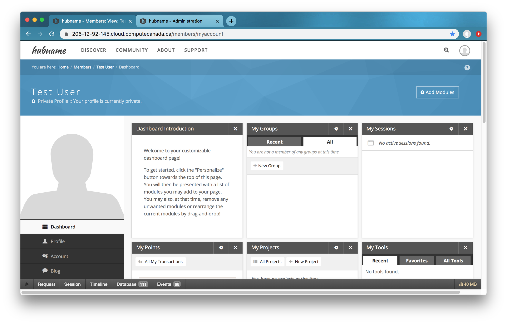
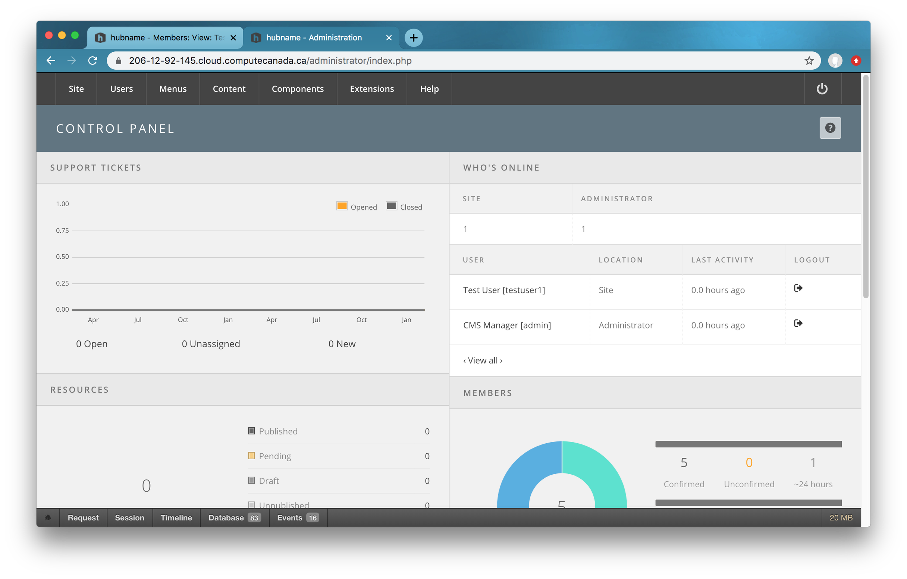

The Radiam HubZero Agent runs on the HubZero Platform, therefore it is configured from the HubZero admin interface. 

### Administrators Configure Radiam Component

A component called Radiam has been developed to link HubZero projects to Radiam projects and send data to Radiam Server. A component is the largest and most complex of the HubZero extension types. You can think of a component as something that has its own functionality, its own database tables and its own presentation. The component is installed and available to administrators after running the migration above.  

- Log into your HubZero administration section
- Click on the menu for Components and find Radiam in the list and click on it
- Edit the `radiam_host_url` setting to match where your Radiam instance is  
  - It should use https and be in this format: https://radiam.somewhere.edu/
  - If it is running on a non-standard port, then include the port: https://radiam.somwehere.edu:8100/
  - For now, only `radiam_host_url` has to be set up manually

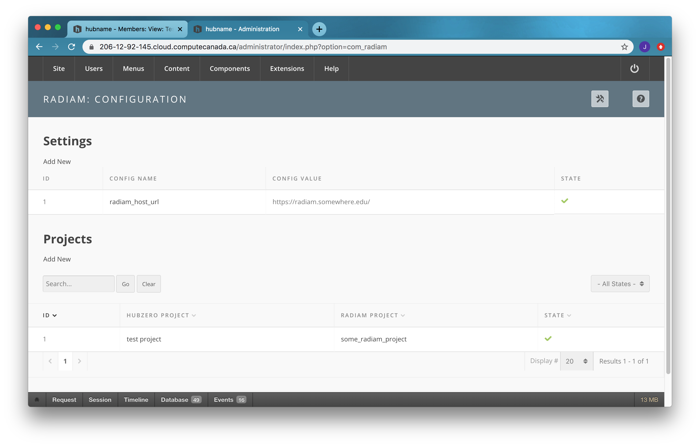


### Administrators Configure Radiam Module

Modules are lightweight and flexible extensions used for page rendering. A module type named mod_radiam has been developed so that the end user can add an “box“ to the end user dashboard, displaying Radiam projects.

The module is installed but not available until you create an instance of it. To make administrators' life easier, a default Radiam module instance is created when installing radiam on HubZero. Administrator can publish it to make it available for end users to install. 

- Log into your HubZero administration section
- Click on the menu Extensions -> Module Manager
- Select `mod_radiam` for the Type
- Click the check mark to publish the module instance

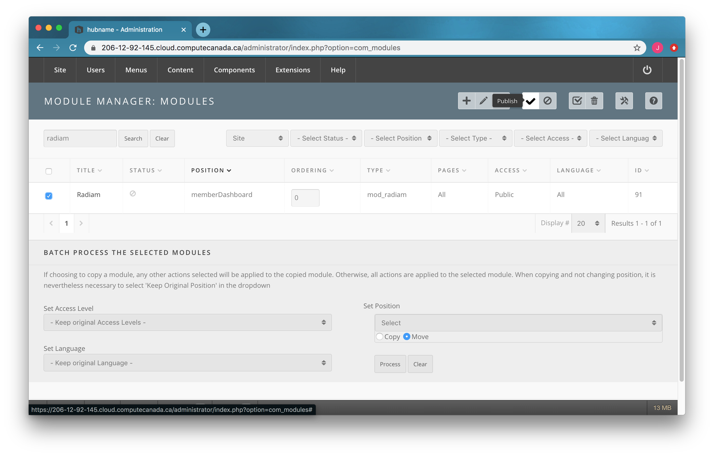

Administrator is free to edit the default Radiam module instance or delete it and create a new one. 

- Log into your HubZero administration section
- Click on the menu Extensions -> Module Manager
- Click the "+" sign to add a new module instance
- Scroll down to the `mod_radiam` module and click on the module name to bring up the Add Module form:
    - Title = Radiam
    - Show Title = show
    - Position = memberDashboard
    - Status = published
    - Access = public
  
Now the end user can add this Radiam Module to his dashboard. 
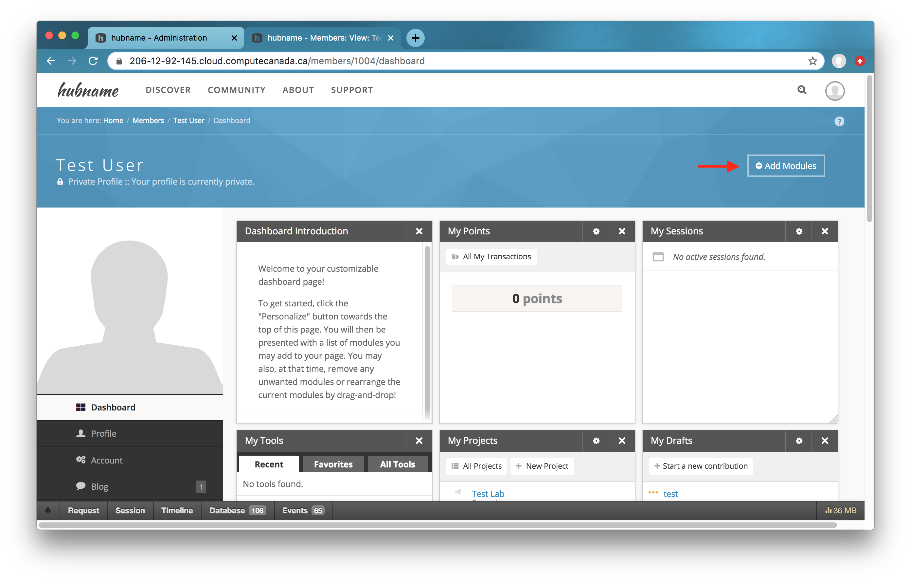
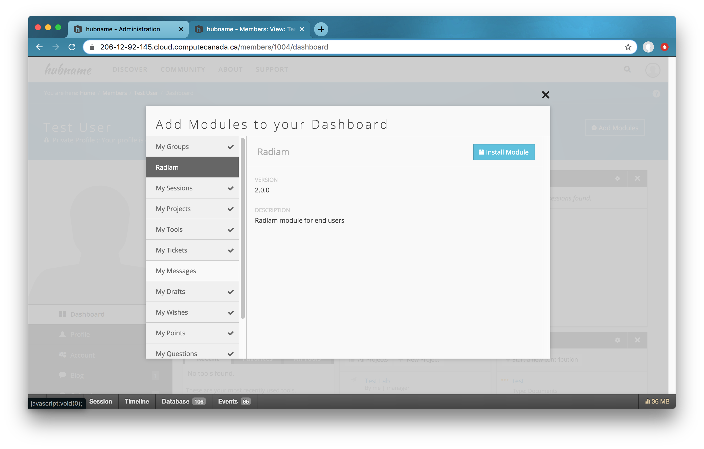

### Regular Users Log into Radiam Server

With the `radiam_host_url` set up by the administrator, regular users
- Click the `Radiam Login` Button in the Radiam Module on the Dashboard
- Log into the Radiam Sever with Radiam username and password
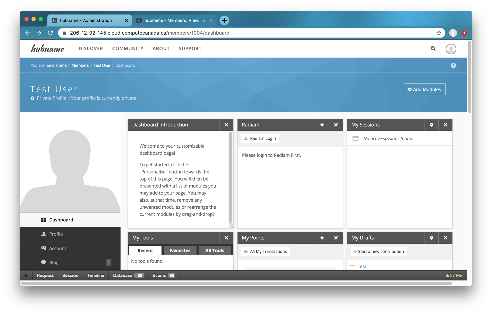
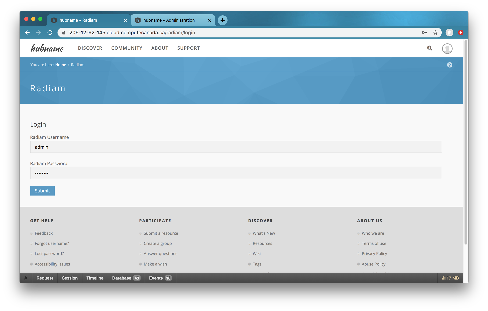

Once the user logs into the Radiam successfully, a token is created for this user. This token is required to send data to the Radiam API.

### Regular Users Create HubZero Porjects
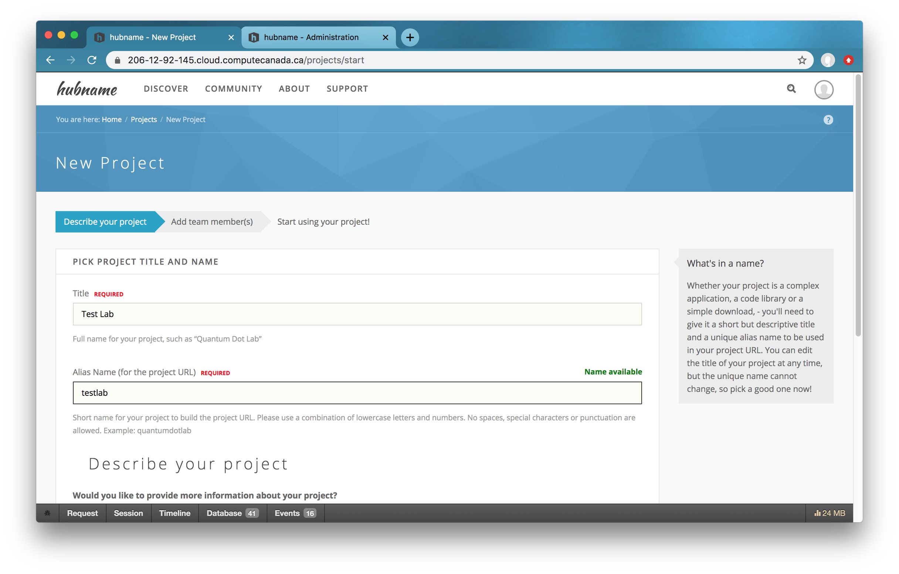

### Administrators Configure Radiam Component
Now the administrator is ready to finish up the configuration under “Projects“ on the Radiam Component page. 
- Log into your HubZero administration section
- Click on the menu for Components and find Radiam in the list and click on it
- Edit the example project or add a new one
  - Select a HubZero project among all active projects from a dropdown list 
  - Select a Radiam project among all available projects under the login Radaim user from a dropdown list

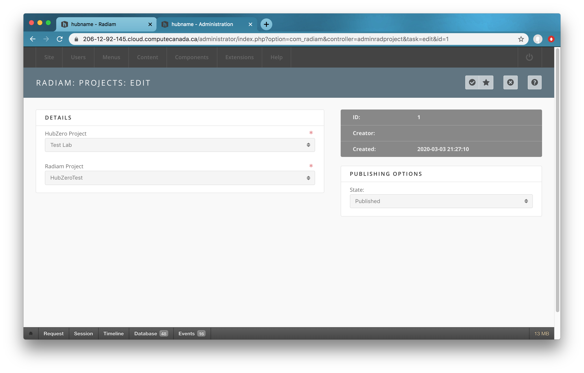


### Plugin Configuration

There are two radiam plugins installed, one for the cron type and one for the projects type. The plugins are installed and available to administrators after running the migration above. The projects/radiam plugin is used to monitor file system events. The cron/radiam plugsin is used to create a cron job to send metadata to the radiam server periodically. 

There is nothing to configure for the radiam plugin of the projects type.

For the radiam plugin of the cron type,

- Log into your HubZero administration section
- Click on the menu for Components and find Cron in the list and click on it
- Edit the `Post data to Radiam API` cron job to meet your needs 
- Publish the `Post data to Radiam API` cron job to start running the Radiam Agent on HubZero

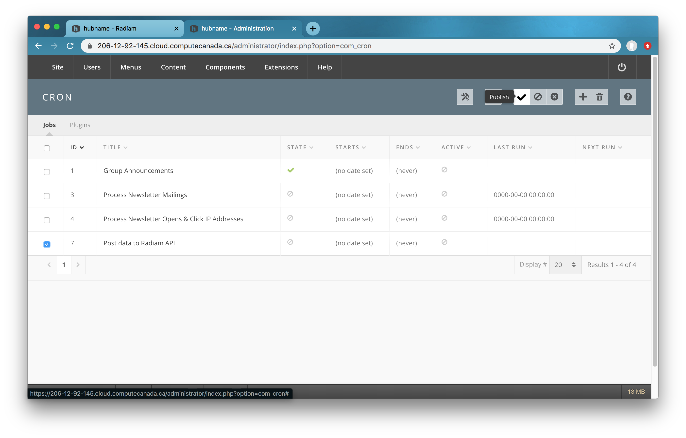


## Viewing

As a regular HubZero user, navigate to your dashboard. Radiam projects under the radiam username are shown in the Radiam Module. By clicking on a radiam project, files in this radiam project are listed in a new page. 
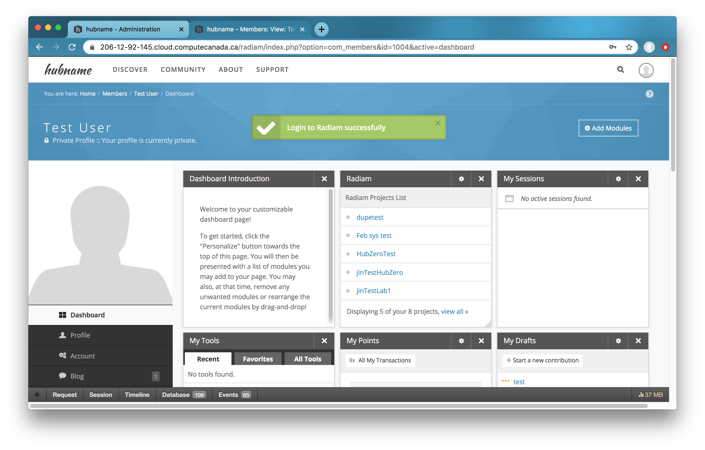
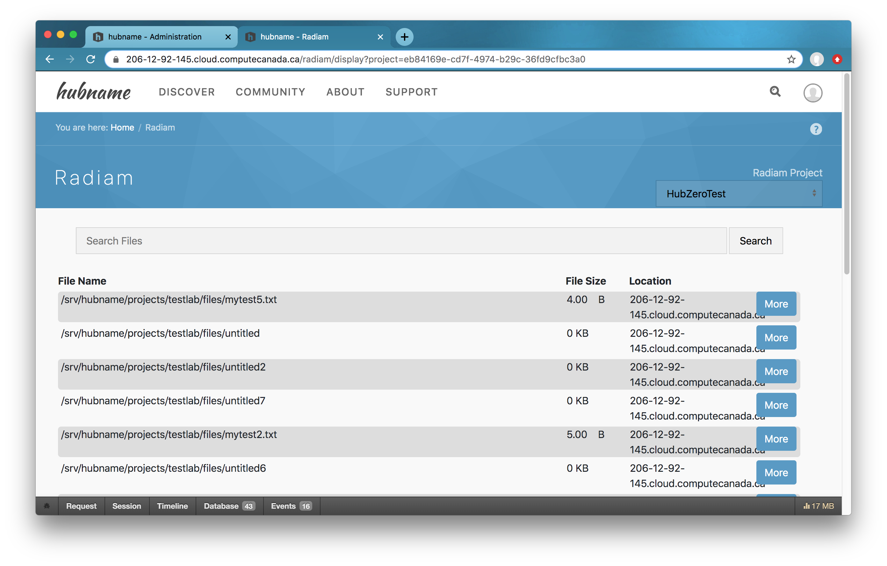

## Removal

### Component Removal

Remove the database tables and entension entries:

```
cd /var/www/hubname

php muse migration -d=down -e=com_radiam -f
```

Then delete the entire contents of the component:

```
cd /var/www/hubname/app/components

rm -rf com_radiam
```

### Module Removal

Remove the database tables and entension entries:

```
cd /var/www/hubname

php muse migration -d=down -e=mod_radiam -f
```

Then delete the entire contents of the component:

```
cd /var/www/hubname/app/modules

rm -rf mod_radiam
```

### Plugin Removal

Remove the database tables and entension entries:

```
cd /var/www/hubname

php muse migration -d=down -e=plg_cron_radiam -f
php muse migration -d=down -e=plg_projects_radiam -f
```

Then delete the entire contents of the component:

```
cd /var/www/hubname/app/plugins

rm -rf cron
rm -rf projects
```

## Troubleshooting
### Link Projects after Agent Created
As mentioned in the Component Configuration session, only `radiam_host_url` is required to configure by the administrator for now. Three more configuration values will be created automatically the first time the Cron job runs. They will be displayed on the Configuration page of the Radiam Component. Please do not touch these configuration values. 
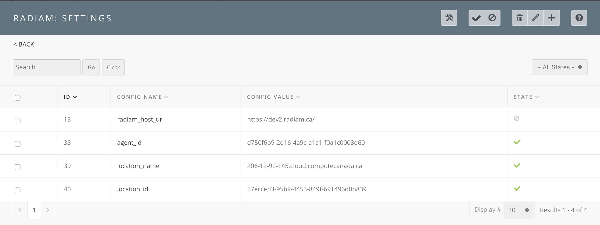

Useragent and location are linked to configured Radiam projects when they are created on the Radiam server. Therefore, if administrators link new projects after useragent and location created, Radiam server knows nothing about it. In this case, you should go into Radiam and add that additional project to the HubZero location. 
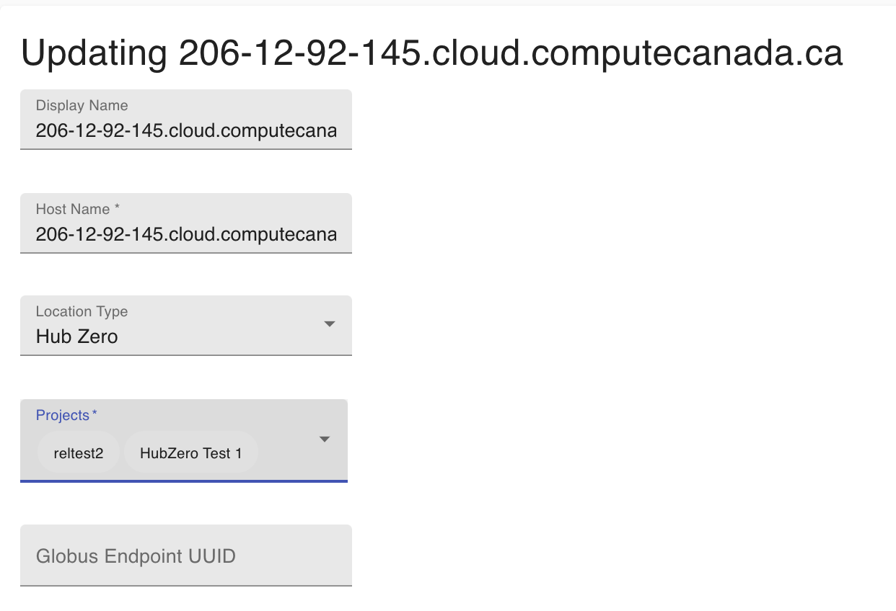

### Existed Files Not Indexed after Linking to Radiam Project
Go to the Radiam Component page, delete the linking of that project and add it again. 
