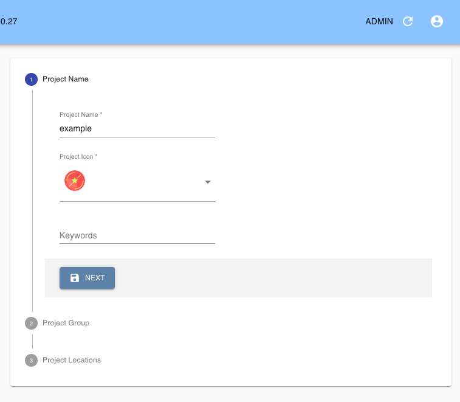

# Radiam Open Science Framework Plugin

Radiam Agent designed for harvesting metadata from the Open Science Framework.

## Configuring

The Radiam OSF Agent runs automatically as part of a Radiam API deployment. Unlike the generic Radiam Agent, it is configured directly from the Radiam admin interface, and will crawl any attached OSF locations continuously.

To configure the Radiam OSF Agent, first ensure that you've created a project in Radiam, from the "Projects" menu on the sidebar (this part will probably already have been done if you've already been working with Radiam):

Next, you need to configure OSF as a location. Navigate to "Locations" on the sidebar and create a new one. You may see other existing locations that you've already crawled using other Radiam agents; when creating a new location manually like this, the configuration values default to what you need for the OSF. Unless you're hosting OSF on your own, you'll want to leave the hostname unchanged from `osf.io`. Display name can be set to whatever you want, and your OSF Project ID should be the five-character string that you can see from your OSF URL when you're logged in to your project, such as `y4z3e` from `https://osf.io/y4z3e/`.

Finally, after creating an OSF location, you should automatically be prompted to configure an agent -- if not, you can select "Agents" from the sidebar. Here, you can associate the OSF location you just configured with a Radiam project using the drop-down list: in this example, "OSF demo" is the OSF location, and "example" is the Radiam project. You'll also need to provide an OSF username and API token. Your username should be the email account that you use to log in to OSF, and to avoid having to enter your OSF password multiple places, you can create an OSF token by navigating to your OSF settings page, going to "Personal access tokens," and making sure to grant your new token `osf.full_read` permissions, then pasting it here. You can also set a time interval for how often your OSF project should be updated in Radiam, though the default setting should be fine.

OSF files will now be continuously indexed and displayed in your Radiam interface.
