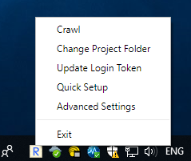
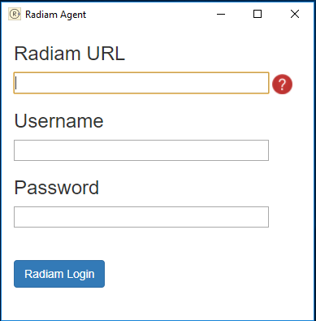
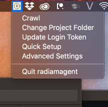

# Radiam Agent


## Binaries Available

On Windows or Mac you may want to run a precompiled binary instead of following these instructions:

https://github.com/usask-rc/radiam-agent-releases

## Getting Started

Python 3 is required to run the Radiam agent from the command line. Ensure that the output of `python3 --version` shows 3.6 or higher.  

If Python 3 is not installed on your Mac, the easiest way to get it is:

* Install homebrew; see https://brew.sh/
* `brew install python3`

On Windows and Mac, install Python dependencies using `pip`.  You may want to run inside a virutal environment (see below) before running this command.
```sh
pip3 install -r requirements.txt
```

If you aren't an administrator and receive an error such as:
```
Could not install packages due to an EnvironmentError: [Errno 13] Permission denied: '/usr/local/lib/python3.5/dist-packages/elasticsearch5'
Consider using the `--user` option or check the permissions.
```

you will either need to run:

```sh
pip install -r requirements.txt --user
```

or alternatively, run inside a virtual environment:
```sh
virtualenv venv
source venv/bin/activate
python --version
```
at this point you should see (venv) to the right of your command prompt, showing you that you are running inside a virtual environment.  You can now check the version of Python inside this environment:
```sh
python --version
```
And if it's indeed version 3, then install the requirements inside the virtual environment:
```sh
pip install -r requirements.txt
```
To exit the virtual environment:
```sh
deactivate
```

Install on Linux is slightly different as there is no binary distribution of libmagic already created for Python -- you'll want to do:
```sh
sed -i '' "s/python-magic-bin/python-magic/g" requirements.txt
pip install -r requirements.txt
```

The Electron GUI in /tray should work for development after doing `npm install` and `npm start`.

If on install you receive the error:

```
error: can't copy 'docx/templates/default-docx-template': doesn't exist or not a regular file
```

Then run:

```sh
pip install -U setuptools
```

## CLI Usage

```sh
$ python radiam.py -d /rootpath/you/want/to/crawl -h hostname -n projectname
```

```sh
Options:
  -d --rootdir=<DIR>  Directory to start crawling from
  -m --mtime=<mt>  Minimum days ago for modified time (default: 0) [default: 0]
  -s --minsize=<ms>  Minimum file size in Bytes (default: 0 Bytes) [default: 0]
  -h --hostname Specify hostname if not in config (e.g. https://localhost:8100, https://dev2.radiam.ca:8100)
  -u --username Specify username if connecting without a token
  -p --password Specify password if connecting without a token
  -n --projectname=<pro> Project name
```

Configuration file is automatically generated after your first run, and stored, along with authorization tokens, in a user-specific directory depending on platform:

```
~/.local/share/radiam-agent/
~/Library/Application Support/radiam-agent
~/AppData/Local/Compute Canada/radiam-agent
```

## GUI Usage

The crawler GUI will launch as a tray app on Windows, Mac, and Linux. Before running a crawl, you need to obtain an auth token by providing your Radiam username and password with the "Get Login Token" menu option, and select the project directory to be crawled with the "Set Projection Location" menu option. You can optionally configure any advanced settings from the "Settings" menu. After configuring the app, select "Crawl" from the tray menu, and it will perform a full crawl of your project directory and continue monitoring for changes in the background.





## Building the crawler and the GUI

The crawler needs to be built on its target platform (Windows/Mac/Linux) using `pyinstaller`, but you'll need to do some additional work to package libmagic in there, so we've included a `pyinstaller.sh` which runs the necessary steps on Windows and Mac.

After building the crawler, the GUI can be built from the `tray` subdirectory with:

`electron-packager . --icon=resources/icon.ico` (Windows)

`electron-packager . --icon=resources/icon.icns` (Mac)

Finally, to package for install:

`electron-installer-windows --src radiamagent-win32-x64/ --dest install/ --config config.json --certificateFile radiam.pfx --certificatePassword [password]` (Windows)

`hdiutil create tmp.dmg -ov -volname "RadiamAgent" -fs HFS+ -srcfolder radiamagent-darwin-x64/ && hdiutil convert tmp.dmg -format UDZO -o RadiamAgent.dmg && rm tmp.dmg` (Mac)

We aren't actively supporting the GUI on Linux, but anecdotally it works fine, though you need to prepend `env XDG_CURRENT_DESKTOP=Unity` to your command to spawn the tray app properly. This means `env XDG_CURRENT_DESKTOP=Unity npm start` when running it for development or `Exec=env XDG_CURRENT_DESKTOP=Unity radiamagent` in a `.desktop` shortcut.

## Advanced features

Radiam can monitor multiple directories and connect to multiple upstream projects by adding additional project headers to the config file.

By default, the config file will contain:

```
project_list = project1

[project1]
rootdir =
name =
```

To configure multiple projects, follow this template:

```
project_list = project1, project2

[project1]
rootdir =
name =

[project2]
rootdir =
name =
```

Radiam can also include advanced metadata extracted from files in its search index. This functionality is disabled by default to avoid uploading any potentially sensitive data, but it can be enabled by changing this line in your config file:

```
#rich_metadata = disabled
```

to `rich_metadata = enabled`. Currently, rich metadata can be extracted from CDF, PDF, Office, or Exiftool-compatible files (most images).

You can also manually provide rich metadata for folders in a file called `[foldername].yml` in each folder using YML syntax:

```
raw: no
analyzed: no
sensitive: yes
```

Which will be indexed as advanced folder metadata in the Radiam interface, similar to advanced file metadata.


Note: The fields "id" and "endpoint" will be automatically filled. Please leave them blank.

## Tests

To run tests on the Python code:
`python -m unittest test`


